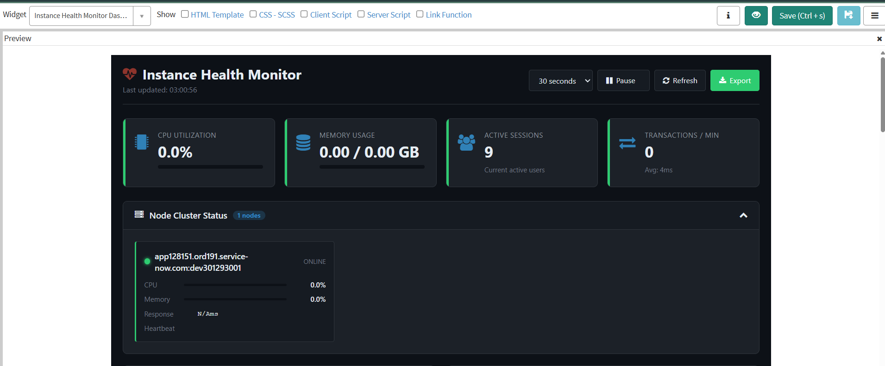

# Instance Health Monitor Dashboard

A production-ready **Instance Health Monitor** widget for the ServiceNow Service Portal. Provides system administrators with real-time visibility into CPU utilization, memory consumption, node health, transaction throughput, database performance, scheduled jobs, and system logs with configurable alerting thresholds.

---

## Features

- **Real-Time Metrics Display** - Live CPU percentage, memory usage (used/total GB), active sessions, and transactions per minute with visual gauges and progress bars
- **Node Cluster Status Grid** - All application nodes with health status (up/down/degraded), response time, load distribution, and last heartbeat
- **Transaction Performance Table** - Top 10 slowest transactions with execution time, user context, table accessed, and drill-down capability
- **Memory Breakdown Visualization** - Stacked bar chart showing memory allocation by category (cache, sessions, scheduled jobs, attachments)
- **Alert Threshold Configuration** - Admin-configurable warning/critical thresholds for CPU, memory, and transaction time with visual breach indicators
- **Historical Performance Graphs** - Interactive Chart.js line charts for CPU, memory, and transaction trends over 1h, 6h, 24h, and 7-day periods
- **Database Statistics Panel** - Query count, average duration, slow query entries, table scan warnings, and connection pool utilization
- **Scheduled Job Monitor** - Currently executing jobs, queue depth, failed job count (last 24h), and next execution times
- **Cache Hit Ratio Metrics** - Database cache, platform cache, and CDN cache effectiveness percentages
- **System Event Log Viewer** - Filterable error/warning events from system logs with timestamp, source, and message
- **Export Diagnostics** - One-click generation of a comprehensive health report for support escalation
- **Auto-Refresh Controls** - Configurable refresh interval (15/30/60 seconds) with pause/resume toggle
- **Collapsible Panels** - Expand/collapse each section independently for a customized dashboard view
- **Accessibility** - WCAG 2.1 AA compliant with aria-live regions, keyboard navigation, and screen reader announcements

---

## Tables Referenced

| Table | Purpose |
|-------|---------|
| `sys_cluster_state` | Node health, CPU, memory, and heartbeat data |
| `syslog_transaction` | Transaction performance metrics and response times |
| `syslog` | System error/warning log entries and scheduled job failures |
| `sys_trigger` | Scheduled job status, queue depth, and execution history |
| `v_transaction` | Active session counts |
| `sys_cache_flush` | Cache operation history |

---

## Tech Stack

- **AngularJS** - Client-side controller with two-way data binding and auto-refresh
- **Chart.js** - Interactive line charts and stacked bar charts for trend visualization
- **GlideRecord / GlideAggregate** - Server-side data queries with role-based access
- **CSS Grid** - 12-column responsive layout with collapsible panels
- **Service Portal** - Widget, page, and instance components

---

## Installation

1. Download `SNLab_instance_health_monitor.xml` from this folder.
2. In your ServiceNow instance, go to **System Update Sets > Retrieved Update Sets**.
3. Click **Import Update Set from XML** and upload the file.
4. **Preview** the update set - review any conflicts.
5. **Commit** the update set.
6. Navigate to your Service Portal and add the **Instance Health Monitor Dashboard** widget to a page.

### Post-Install

- The widget reads system tables that require **admin** or **itil** role access.
- Configure alert thresholds via the built-in threshold configuration panel.
- Adjust auto-refresh interval based on your monitoring needs.

---

## What's Included

The update set contains:

- Service Portal widget (HTML template, client script, server script, CSS)
- Portal page and layout configuration
- Threshold configuration defaults
- Responsive dashboard layout with 9 collapsible panels

---

## Author

**iDevOpsLLC** | [YouTube - @AgenticServiceNow](https://www.youtube.com/@AgenticServiceNow)

## License

[MIT](../LICENSE)
