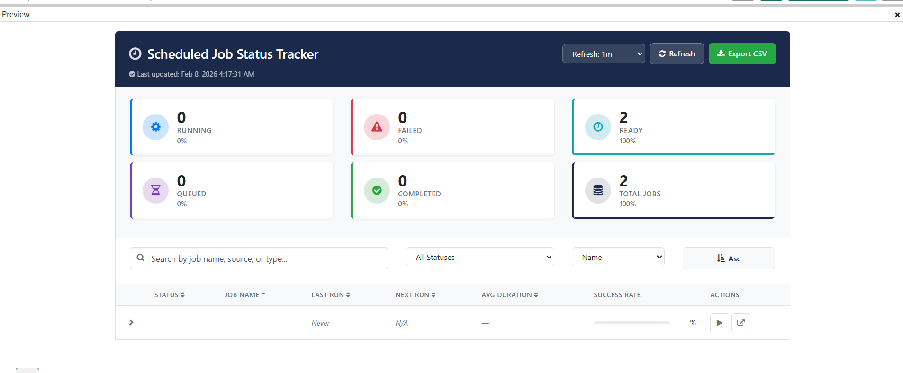

# Scheduled Job Status Tracker

A production-ready **Scheduled Job Status Tracker** widget for the ServiceNow Service Portal. Provides real-time scheduled job monitoring and management with status tracking, execution history, success rate analysis, admin controls, and CSV export.

---

## Features

- **Real-Time Status Dashboard** — Summary cards for Running, Failed, Ready, Queued, Completed, and Total Jobs with percentage breakdowns and color-coded indicators
- **Auto-Refresh** — Configurable refresh intervals (30s, 1m, 2m, 5m, 10m) with manual refresh button and visual countdown
- **Job Search** — Full-text search across job name, source table, run type, and sys_id
- **Status Filtering** — Filter by Running, Failed, Ready, Queued, or Completed states via clickable summary cards
- **Multi-Column Sorting** — Sort by Status, Job Name, Last Run, Next Run, Average Duration, or Success Rate in ascending/descending order
- **Expandable Job Details** — Click any row to reveal execution history, error logs, and dependency information
- **Execution History** — Last 5 execution records per job with state, duration, and completion timestamps
- **Error Log Viewer** — Recent error, warning, and critical log entries related to each scheduled job
- **Job Dependencies** — Linked script includes and business rules discovered from job metadata
- **Admin Actions** — Trigger jobs manually and cancel running jobs (admin role required)
- **Direct Record Navigation** — Open job records directly in the platform UI from the widget
- **CSV Export** — Export filtered job list with all columns to a downloadable CSV file
- **Success Rate Tracking** — Per-job success rate percentage with visual progress bar indicator
- **Pagination** — Client-side pagination with configurable page size (50 default) and page navigation
- **Toast Notifications** — Success, error, and info feedback for all user actions
- **Relative Time Display** — Human-readable timestamps ("5m ago", "In 2h") for Last Run and Next Run columns
- **Responsive Design** — CSS Grid layout with flex-wrap for header actions and summary cards
- **Accessibility** — WCAG 2.1 AA compliant with focus-visible outlines, keyboard navigation (Enter/Space), and ARIA roles

---

## Tables Referenced

| Table | Purpose |
|-------|---------|
| `sys_trigger` | Scheduled job trigger state, type, and next action time |
| `sysauto_script` | Scheduled script execution definitions and metadata |
| `sys_execution_tracker` | Execution history, completion codes, and durations |
| `syslog` | Error/warning log entries related to jobs |
| `sys_script_include` | Script include dependencies |
| `sys_script` | Business rule dependencies |

---

## Tech Stack

- **AngularJS** — Client-side controller with two-way data binding and digest-cycle management
- **GlideRecord / GlideAggregate** — Server-side job queries with role-based access control
- **CSS Variables** — Themed styling with dark mode support
- **CSS Grid** — Responsive layout for summary cards, filters, and job table
- **Font Awesome** — Iconography for status indicators, actions, and navigation
- **Blob / URL API** — Client-side CSV file generation and download

---

## Installation

1. Download `SNLab_scheduled_job_tracker.xml` from this folder.
2. In your ServiceNow instance, go to **System Update Sets > Retrieved Update Sets**.
3. Click **Import Update Set from XML** and upload the file.
4. **Preview** the update set — review any conflicts.
5. **Commit** the update set.
6. Navigate to your Service Portal and add the **Scheduled Job Status Tracker** widget to a page.

### Post-Install

- The widget queries scheduled job tables that require **admin** or **itil** role access.
- Admin role is required for trigger and cancel actions.
- Configure auto-refresh interval and default filters using the built-in controls.

---

## What's Included

The update set contains:

- Service Portal widget (HTML template, client script, server script, CSS)
- Portal page configuration
- Status-based color theme and responsive dashboard layout
- Summary statistics dashboard with percentage breakdowns

---

## Author

**iDevOpsLLC** | [YouTube - @AgenticServiceNow](https://www.youtube.com/@AgenticServiceNow)

## License

[MIT](../LICENSE)
