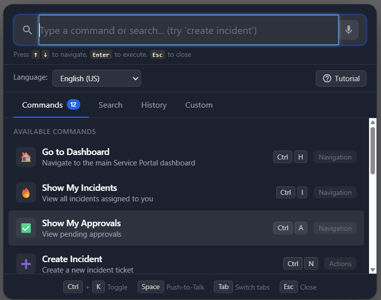

# Voice Navigation

A **push-to-talk voice command** widget for the ServiceNow Service Portal. Navigate pages, search records, create items, and perform actions using natural speech or a keyboard-driven command palette.

> **Tutorial:** See [Voice Navigation docs.docx](Voice%20Navigation%20docs.docx) for a full walkthrough with screenshots.

---

## Features

- **Push-to-Talk** - Click and hold the microphone button or press Space (when palette is open) to speak commands
- **Command Palette (Ctrl+K)** - Keyboard-driven command launcher with fuzzy search, arrow-key navigation, and Enter to execute
- **12 Built-in Commands** - Go to dashboard, create incident, search knowledge base, open approvals, and more
- **Record Navigation** - Open specific records by number (e.g., "open change CHG0012345")
- **Multi-Language Support** - 10 languages including English, Spanish, French, German, Japanese, Chinese, Portuguese, Korean, and Italian
- **Audio Waveform Visualization** - Real-time frequency visualization via Canvas and Web Audio API while listening
- **Interactive Tutorial** - 8-step guided walkthrough with practice prompts for new users
- **Custom Commands** - Create personal voice shortcuts mapped to any URL or portal page
- **Command History** - Tracks and displays recent voice commands for quick re-use
- **Toast Notifications** - Contextual feedback for command execution, errors, and status changes
- **Accessibility** - ARIA live regions for screen reader announcements, keyboard-navigable interface

---

## Built-in Commands

| Command | Action |
|---------|--------|
| "Go to dashboard" | Navigate to the main dashboard |
| "Create incident" | Open a new incident form |
| "My approvals" | Navigate to pending approvals |
| "Search [query]" | Search incidents, knowledge, catalog, and users |
| "Open [record number]" | Navigate directly to a record (INC, CHG, REQ, etc.) |
| "My tickets" | View assigned incidents |
| "Knowledge base" | Browse knowledge articles |
| "Service catalog" | Open the service catalog |
| "Create change" | Open a new change request form |
| "My tasks" | View assigned tasks |
| "Help" | Launch the interactive tutorial |
| "Settings" | Open voice navigation preferences |

---

## Tech Stack

- **Web Speech API** - Browser-native speech recognition (`SpeechRecognition` / `webkitSpeechRecognition`)
- **Web Audio API** - Microphone stream analysis for waveform visualization
- **Canvas API** - Real-time audio frequency bar rendering
- **AngularJS** - Client-side controller with scope management
- **GlideRecord** - Server-side ServiceNow data queries

---

## Browser Requirements

| Browser | Minimum Version | Notes |
|---------|----------------|-------|
| Google Chrome | 33+ | Full support (recommended) |
| Microsoft Edge | 79+ | Chromium-based, full support |
| Safari | 14.1+ | Partial support |
| Firefox | Not supported | Web Speech API not available |

- **HTTPS required** - Speech recognition requires a secure context
- **Microphone permission** - Browser will prompt for microphone access on first use

---

## Installation

1. Download `SNLab_voice_widget.xml` from this folder.
2. In your ServiceNow instance, go to **System Update Sets > Retrieved Update Sets**.
3. Click **Import Update Set from XML** and upload the file.
4. **Preview** the update set - review any conflicts.
5. **Commit** the update set.
6. Navigate to your Service Portal and add the **Voice Navigation** widget to a page, or use the included portal page.

### Post-Install

- The floating microphone button appears on portal pages where the widget is embedded.
- Press **Ctrl+K** (or **Cmd+K** on Mac) to open the command palette from any portal page.
- Click the **?** button to launch the interactive tutorial.

---

## What's Included

The update set contains:

- Service Portal widget (HTML template, client script, server script, CSS)
- Complete command processing logic
- Audio visualization system
- Tutorial system with 8 guided steps
- Custom command management interface
- Responsive design for desktop and mobile

---

## Author

**iDevOpsLLC** | [YouTube - @AgenticServiceNow](https://www.youtube.com/@AgenticServiceNow)

## License

[MIT](../LICENSE)
